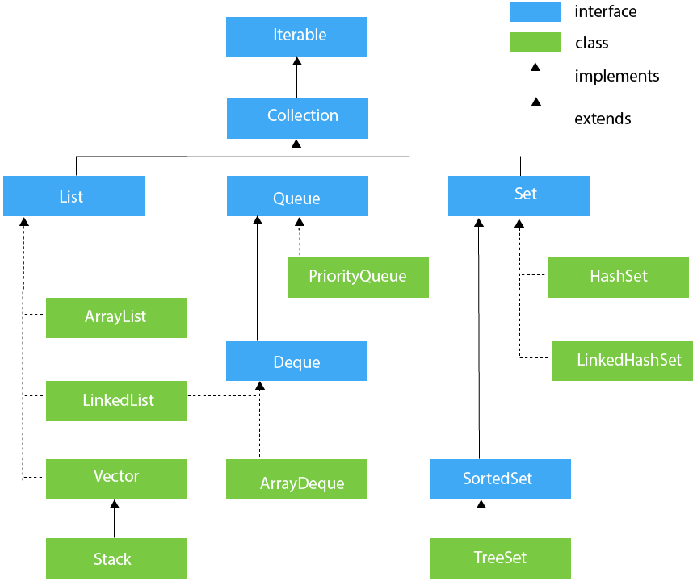
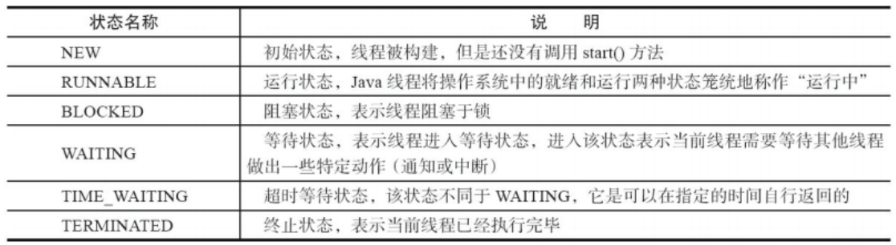
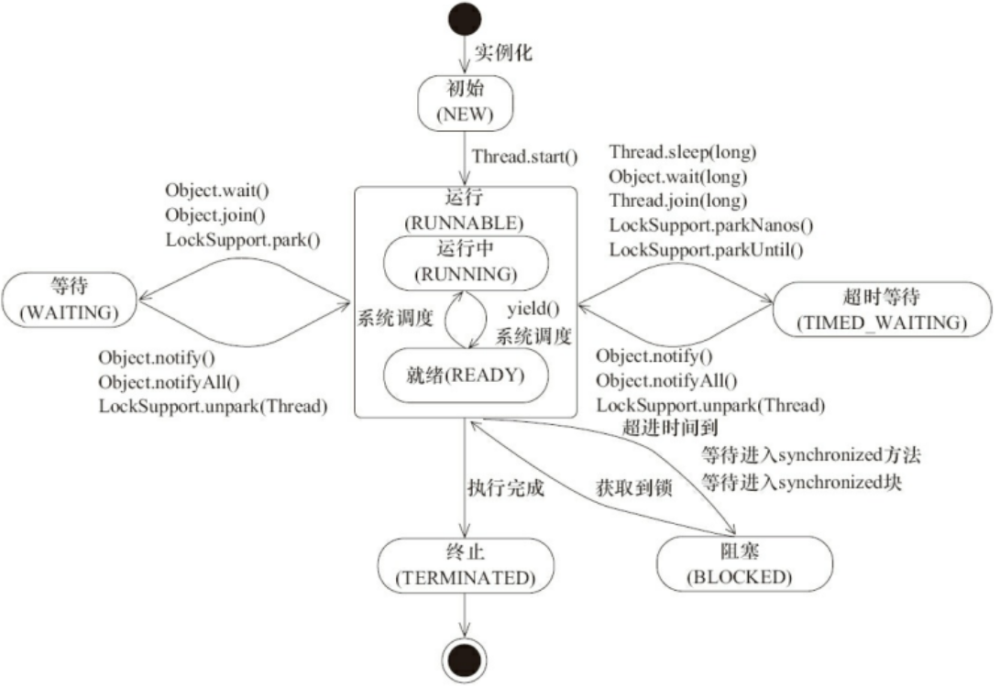
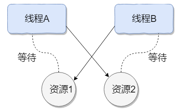

# 一、集合

### 如何选用集合

主要根据集合的特点来选用，比如我们需要根据键值获取到元素值时就选用 `Map` 接口下的集合，需要排序时选择 `TreeMap`,不需要排序时就选择 `HashMap`,需要保证线程安全就选用 `ConcurrentHashMap`。

当我们只需要存放元素值时，就选择实现`Collection` 接口的集合，需要保证元素唯一时选择实现 `Set` 接口的集合比如 `TreeSet` 或 `HashSet`，不需要就选择实现 `List` 接口的比如 `ArrayList` 或 `LinkedList`，然后再根据实现这些接口的集合的特点来选用。

## Collection子接口之List

### ArrayList和Vector的区别？

- `ArrayList` 是 `List` 的主要实现类，底层使用 `Object[ ]`存储，适用于频繁的查找工作，线程不安全 ；
- `Vector` 是 `List` 的古老实现类，底层使用` Object[ ]` 存储，线程安全的。
- 

### ArrayList和LinkList的区别？

1. **是否保证线程安全：** `ArrayList` 和 `LinkedList` 都是不同步的，也就是不保证线程安全；
2. **底层数据结构：** `Arraylist` 底层使用的是 **`Object` 数组**；`LinkedList` 底层使用的是 **双向链表** 数据结构（JDK1.6 之前为循环链表，JDK1.7 取消了循环。注意双向链表和双向循环链表的区别，下面有介绍到！）
3. **插入和删除是否受元素位置的影响：** ① **`ArrayList` 采用数组存储，所以插入和删除元素的时间复杂度受元素位置的影响。** 比如：执行`add(E e)`方法的时候， `ArrayList` 会默认在将指定的元素追加到此列表的末尾，这种情况时间复杂度就是 O(1)。但是如果要在指定位置 i 插入和删除元素的话（`add(int index, E element)`）时间复杂度就为 O(n-i)。因为在进行上述操作的时候集合中第 i 和第 i 个元素之后的(n-i)个元素都要执行向后位/向前移一位的操作。 ② **`LinkedList` 采用链表存储，所以对于`add(E e)`方法的插入，删除元素时间复杂度不受元素位置的影响，近似 O(1)，如果是要在指定位置`i`插入和删除元素的话（`(add(int index, E element)`） 时间复杂度近似为`o(n))`因为需要先移动到指定位置再插入。**
4. **是否支持快速随机访问：** `LinkedList` 不支持高效的随机元素访问，而 `ArrayList` 支持。快速随机访问就是通过元素的序号快速获取元素对象(对应于`get(int index)`方法)。
5. **内存空间占用：** ArrayList 的空 间浪费主要体现在在 list 列表的结尾会预留一定的容量空间，而 LinkedList 的空间花费则体现在它的每一个元素都需要消耗比 ArrayList 更多的空间（因为要存放直接后继和直接前驱以及数据）。

### ArrayList的扩容机制

## Collection子接口之Set

### HashMap

 JDK1.8 之前 `HashMap` 由数组+链表组成的，数组是 `HashMap` 的主体，链表则是主要为了解决哈希冲突而存在的（“拉链法”解决冲突）。JDK1.8 以后在解决哈希冲突时有了较大的变化，当链表长度大于阈值（默认为 8）（将链表转换成红黑树前会判断，如果当前数组的长度小于 64，那么会选择先进行数组扩容，而不是转换为红黑树）时，将链表转化为红黑树，以减少搜索时间

### HashMap的长度为什么是2的幂次方？

为了能让 HashMap 存取高效，尽量较少碰撞，也就是要尽量把数据分配均匀。我们上面也讲到了过了，Hash 值的范围值-2147483648 到 2147483647，前后加起来大概 40 亿的映射空间，只要哈希函数映射得比较均匀松散，一般应用是很难出现碰撞的。但问题是一个 40 亿长度的数组，内存是放不下的。所以这个散列值是不能直接拿来用的。用之前还要先做对数组的长度取模运算，得到的余数才能用来要存放的位置也就是对应的数组下标。这个数组下标的计算方法是“ `(n - 1) & hash`”。（n 代表数组长度）。这也就解释了 HashMap 的长度为什么是 2 的幂次方。

我们首先可能会想到采用%取余的操作来实现。但是，重点来了：**“取余(%)操作中如果除数是 2 的幂次则等价于与其除数减一的与(&)操作（也就是说 hash%length==hash&(length-1)的前提是 length 是 2 的 n 次方；）。”** 并且 **采用二进制位操作 &，相对于%能够提高运算效率，这就解释了 HashMap 的长度为什么是 2 的幂次方。**

# 二、 I/O

# 三、多线程

## 1. 基础知识

### 1.1. 什么是进程、线程以及它们之间的关系

- 进程是程序的一次执行过程，是系统运行程序的基本单位，因此进程是动态的。系统运行一个程序即是一个进程从创建，运行到消亡的过程。在 Java 中，当我们启动 main 函数时其实就是启动了一个 JVM 的进程，而 main 函数所在的线程就是这个进程中的一个线程，也称主线程。

- 线程与进程相似，但线程是一个比进程更小的执行单位。一个进程在其执行的过程中可以产生多个线程。线程是进程的一个实体,是CPU调度和分派的基本单位,它是比进程更小的能独立运行的基本单位.线程自己基本上不拥有系统资源,只拥有一点在运行中必不可少的资源(如程序计数器,一组寄存器和栈),但是它可与同属一个进程的其他的线程共享进程所拥有的全部资源.

  

- 进程和线程的主要差别在于它们是不同的操作系统资源管理方式。进程是操作系统分配资源的最小单元，线程是操作系统调度的最小单元。

- (进程有独立的地址空间，一个进程崩溃后，在保护模式下不会对其他进程产生影响。)

- 一个进程中可以有多个线程，多个线程共享进程的堆和方法区（JDK1.8之后的元空间）资源，单每个线程有自己的**程序计数器**、**虚拟机栈**和**本地方法栈**。所以系统在产生一个线程，或是在各个线程之间作切换工作时，负担要比进程小得多，也正因为如此，线程也被称为轻量级进程。

- **总结：** **线程是进程划分成的更小的运行单位。线程和进程最大的不同在于基本上各进程是独立的，而各线程则不一定，因为同一进程中的线程极有可能会相互影响。线程执行开销小，但不利于资源的管理和保护；而进程正相反。**

### 1.2 进程之间的通信方式？线程之间的通信方式？

进程间通信方式有以下4种：

1. **共享内存**：共享内存是最快的进程间通讯方式
2. **信号量**：信号量的本质是计数器，用于多进程对共享数据对象的访问。在访问临界资源之前需要测试信号量，如果为正数，则信号量-1并且进程可以进入临界区，若为非正数，则进程挂起放入等待队列，直至有进程退出临界区，释放资源并+1信号量，此时唤醒等待队列的进程。
3. **管道**：单向，一段输入，另一端输出，先进先出。管道也是文件，管道大小4096字节（4K）。管道满时，写阻塞，管道空时，读阻塞
4. **消息队列**：先进先出

也有说八种的：

1. **管道(pipe)**：管道可用于具有亲缘关系的进程间的通信，是一种半双工的方式，数据只能单向流动，允许一个进程和另一个与它有共同祖先的进程之间进行通信。
2. **命名管道(named pipe)**：命名管道克服了管道没有名字的限制，同时除了具有管道的功能外（也是半双工），它还允许无亲缘关系进程间的通信。命名管道在文件系统中有对应的文件名。命名管道通过命令mkfifo或系统调用mkfifo来创建。
3. **信号（signal）**：信号是比较复杂的通信方式，用于通知接收进程有某种事件发生了，除了进程间通信外，进程还可以发送信号给进程本身；linux除了支持Unix早期信号语义函数sigal外，还支持语义符合Posix.1标准的信号函数sigaction（实际上，该函数是基于BSD的，BSD为了实现可靠信号机制，又能够统一对外接口，用sigaction函数重新实现了signal函数）。
4. **消息队列**：消息队列是消息的链接表，包括Posix消息队列system V消息队列。有足够权限的进程可以向队列中添加消息，被赋予读权限的进程则可以读走队列中的消息。消息队列克服了信号承载信息量少，管道只能承载无格式字节流以及缓冲区大小受限等缺
5. **共享内存**：使得多个进程可以访问同一块内存空间，是最快的可用IPC形式。是针对其他通信机制运行效率较低而设计的。往往与其它通信机制，如信号量结合使用，来达到进程间的同步及互斥。
6. **内存映射**：内存映射允许任何多个进程间通信，每一个使用该机制的进程通过把一个共享的文件映射到自己的进程地址空间来实现它。
7. **信号量（semaphore）**：主要作为进程间以及同一进程不同线程之间的同步手段。
8. **套接字（Socket）**：更为一般的进程间通信机制，可用于不同机器之间的进程间通信。起初是由Unix系统的BSD分支开发出来的，但现在一般可以移植到其它类Unix系统上：Linux和System V的变种都支持套接字。

线程间通信方式

1. **volatile关键字**：volatile有两大特性，一是可见性，而是有序性，禁止指令重排序，其中可见性就是可以让线程之间进行通信。

   volatile语义保证线程可见性有两个原则保证：

   - 所有volatile修饰的变量一旦被某个线程更改，必须立即刷新到主内存
   - 所有volatile修饰的变量在使用之前必须重新读取主内存的值

   原理见**进阶**

2. **等待/通知机制**：等待通知机制是基于wait和notify方法来实现的，在一个线程内调用该线程锁对象的wait方法，线程将进入等待队列进行等待直到被通知或者被唤醒。

   为什么要必须获取锁？

   因为调用wait方法时，必须先释放锁，如果没有持有锁将会抛出异常。

   wait流程原理见**进阶**

3. **join方式**：join其实合理理解成是线程合并，当在一个线程调用另一个线程的join方法时，当前线程阻塞等待被调用join方法的线程执行完毕才能继续执行，所以join的好处能够保证线程的执行顺序，但是如果调用线程的join方法其实已经失去了并行的意义，虽然存在多个线程，但是本质上还是串行的，最后join的实现其实是基于等待通知机制的。

4. **threadLocal**：threadLocal方式的线程通信，不像以上三种方式是多个线程之间的通信，它更像是一个线程内部的通信，将当前线程和一个map绑定，在当前线程内可以任意存取数据，减省了方法调用间参数的传递。

### 1.3. 程序计数器为什么是私有的？

程序计数器主要有下面两个作用：

1. 字节码解释器通过改变程序计数器来依次读取指令，从而实现代码的流程控制，如：顺序执行、选择、循环、异常处理。
2. 在多线程的情况下，程序计数器用于记录当前线程执行的位置，从而当线程被切换回来的时候能够知道该线程上次运行到哪儿了。

需要注意的是，如果执行的是 native 方法，那么程序计数器记录的是 undefined 地址，只有执行的是 Java 代码时程序计数器记录的才是下一条指令的地址。

所以，程序计数器私有主要是为了**线程切换后能恢复到正确的执行位置**。

### 1.4 虚拟机栈和本地方法栈为什么是私有的？

- **虚拟机栈：** 每个 Java 方法在执行的同时会创建一个栈帧用于存储局部变量表、操作数栈、常量池引用等信息。从方法调用直至执行完成的过程，就对应着一个栈帧在 Java 虚拟机栈中入栈和出栈的过程。
- **本地方法栈：** 和虚拟机栈所发挥的作用非常相似，区别是： **虚拟机栈为虚拟机执行 Java 方法 （也就是字节码）服务，而本地方法栈则为虚拟机使用到的 Native 方法服务。** 在 HotSpot 虚拟机中和 Java 虚拟机栈合二为一。

所以，为了**保证线程中的局部变量不被别的线程访问到**，虚拟机栈和本地方法栈是线程私有的。

### 1.5 一句话简单了解堆和方法区

堆和方法区是所有线程共享的资源，其中堆是进程中最大的一块内存，主要用于存放新创建的对象 (几乎所有对象都在这里分配内存)，方法区主要用于存放已被加载的类信息、常量、静态变量、即时编译器编译后的代码等数据。

### 1.6 并发、并行、串行的区别？

- 并发：同一时间段，多个任务都在执行（单位时间内不一定同时执行）
- 并行：单位时间内，多个人物同时执行
- 串行：一个任务执行完再执行另一个任务

### 1.7 使用多线程可能带来什么问题

并发编程的目的就是为了能提高程序的执行效率提高程序运行速度，但是并发编程并不总是能提高程序运行速度的，而且并发编程可能会遇到很多问题，比如：内存泄漏、死锁、线程不安全等等。

### 1.8 说说线程的生命周期和状态

Java线程在运行的生命周期中地指定时刻只可能处于下面6种不同状态的其中一个状态

### 1.9 说说 sleep() 方法和 wait() 方法区别和共同点?

- 两者最主要的区别在于：**`sleep()` 方法没有释放锁，而 `wait()` 方法释放了锁** 。
- 两者都可以暂停线程的执行。
- `wait()` 通常被用于线程间交互/通信，`sleep() `通常被用于暂停执行。
- `wait()` 方法被调用后，线程不会自动苏醒，需要别的线程调用同一个对象上的 `notify() `或者 `notifyAll()` 方法。`sleep() `方法执行完成后，线程会自动苏醒。或者可以使用 `wait(long timeout)` 超时后线程会自动苏醒。

### 1.10 为什么我们调用 start() 方法时会执行 run() 方法，为什么我们不能直接调用 run() 方法？

new 一个 Thread，线程进入了新建状态。调用 `start()`方法，会启动一个线程并使线程进入了就绪状态，当分配到时间片后就可以开始运行了。 `start()` 会执行线程的相应准备工作，然后自动执行 `run()` 方法的内容，这是真正的多线程工作。 但是，直接执行 `run()` 方法，会把 `run()` 方法当成一个 main 线程下的普通方法去执行，并不会在某个线程中执行它，所以这并不是多线程工作。

**总结： 调用 `start()` 方法方可启动线程并使线程进入就绪状态，直接执行 `run()` 方法的话不会以多线程的方式执行。**

### 1.11 什么是上下文切换

多线程编程中一般线程的个数都大于 CPU 核心的个数，而一个 CPU 核心在任意时刻只能被一个线程使用，为了让这些线程都能得到有效执行，CPU 采取的策略是为每个线程分配时间片并轮转的形式。当一个线程的时间片用完的时候就会重新处于就绪状态让给其他线程使用，这个过程就属于一次上下文切换。

概括来说就是：当前任务在执行完 CPU 时间片切换到另一个任务之前会先保存自己的状态，以便下次再切换回这个任务时，可以再加载这个任务的状态。**任务从保存到再加载的过程就是一次上下文切换**。

上下文切换通常是计算密集型的。也就是说，它需要相当可观的处理器时间，在每秒几十上百次的切换中，每次切换都需要纳秒量级的时间。所以，上下文切换对系统来说意味着消耗大量的 CPU 时间，事实上，可能是操作系统中时间消耗最大的操作。

Linux 相比与其他操作系统（包括其他类 Unix 系统）有很多的优点，其中有一项就是，其上下文切换和模式切换的时间消耗非常少。

### 1.12 什么是线程死锁？如何避免死锁？

#### 1.12.1 线程死锁

多个线程同时被阻塞，它们中地一个或全部都在等待某个资源被释放。由于线程被无限地阻塞，因此程序不可能正常终止。如图：

#### 1.12.2 产生死锁的四个必要条件：

1. **互斥条件**：该资源任意一个时刻只由一个线程占用。
2. **请求与保持条件**：一个进程因请求资源而阻塞时，对已获得的资源保持不放。
3. **不剥夺条件**:线程已获得的资源在未使用完之前不能被其他线程强行剥夺，只有自己使用完毕后才释放资源。
4. **循环等待条件**:若干进程之间形成一种头尾相接的循环等待资源关系。

#### 1.12.3 如何避免死锁？

上面说了产生死锁的四个必要条件，为了避免死锁，只要破坏产生死锁的四个条件中的其中一个就可以了。挨个分析一下：

1. **破坏互斥条件** ：这个条件我们没有办法破坏，因为我们用锁本来就是想让他们互斥的（临界资源需要互斥访问）。
2. **破坏请求与保持条件** ：一次性申请所有的资源。
3. **破坏不剥夺条件** ：占用部分资源的线程进一步申请其他资源时，如果申请不到，可以主动释放它占有的资源。
4. **破坏循环等待条件** ：靠按序申请资源来预防。按某一顺序申请资源，释放资源则反序释放。破坏循环等待条件。

## 2. 进阶

### 2.1 volatile关键字

### 2.2 synchronized关键字

### 2.3 volatile和synchronized的区别

# 四、Java虚拟机

