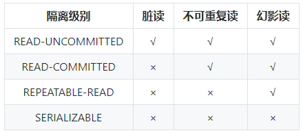

# 一、查询

# 二、 常见问题总结

##  1. MyISAM与InnoDB的区别

### 1.1 区别：

-  **InnoDB支持事务，MyISAM不支持，**对于InnoDB每一条SQL语言都默认封装成事务，自动提交，这样会影响速度，所以最好把多条SQL语言放在begin和commit之间，组成一个事务；

- **InnoDB支持外键，而MyISAM不支持。**对一个包含外键的InnoDB表转为MYISAM会失败；

-  **InnoDB 是聚集索引，MyISAM 是非聚集索引。**聚簇索引的文件存放在主键索引的叶子节点上，因此 InnoDB 必须要有主键，通过主键索引效率很高。但是辅助索引需要两次查询，先查询到主键，然后再通过主键查询到数据。因此，主键不应该过大，因为主键太大，其他索引也都会很大。而 MyISAM 是非聚集索引，也是使用B+Tree作为索引结构，数据文件是分离的，索引保存的是数据文件的指针。主键索引和辅助索引是独立的。 索引和数据文件是分离的，索引保存的是数据文件的指针。主键索引和辅助索引是独立的。

  也就是说：InnoDB的B+树主键索引的叶子节点就是数据文件，辅助索引的叶子节点是主键的值；而MyISAM的B+树主键索引和辅助索引的叶子节点都是数据文件的地址指针。

- **InnoDB 最小的锁粒度是行锁，MyISAM 最小的锁粒度是表锁。**一个更新语句会锁住整张表，导致其他查询和更新都会被阻塞，因此并发访问受限。这也是 MySQL 将默认存储引擎从 MyISAM 变成 InnoDB 的重要原因之一；

- **是否支持MVCC ：仅 InnoDB 支持。**应对高并发事务, MVCC比单纯的加锁更高效;MVCC只在 `READ COMMITTED` 和 `REPEATABLE READ` 两个隔离级别下工作;MVCC可以使用 乐观(optimistic)锁 和 悲观(pessimistic)锁来实现;各数据库中MVCC实现并不统一

- **Innodb存储文件有frm、ibd，而Myisam是frm、MYD、MYI**

  ​    **Innodb：frm是表定义文件，ibd是数据文件**

  ​    **Myisam：frm是表定义文件，myd是数据文件，myi是索引文件**

- 对于自增长的字段，InnoDB中必须包含只有该字段的索引，但是在MyISAM表中可以和其他字段一起建立联合索引。

-  InnoDB 不保存表的具体行数，执行 select count(*) from table 时需要全表扫描。而MyISAM 用一个变量保存了整个表的行数，执行上述语句时只需要读出该变量即可，速度很快；

- 清空整个表时，InnoDB是一行一行的删除，效率非常慢。MyISAM则会重建表。

### 1.2 如何选择

  1. 是否要支持事务，如果要请选择innodb，如果不需要可以考虑MyISAM；
  2. 如果表中绝大多数都只是读查询，可以考虑MyISAM，如果既有读也有写，请使用InnoDB。
  3. 系统奔溃后，MyISAM恢复起来更困难，能否接受；
  4. MySQL5.5版本开始Innodb已经成为Mysql的默认引擎(之前是MyISAM)，说明其优势是有目共睹的，如果你不知道用什么，那就用InnoDB，至少不会差。

### 1.3 InnoDB为什么推荐使用自增ID作为主键？

自增ID可以保证每次插入时B+索引是从右边扩展的，可以避免B+树和频繁合并和分裂（对比使用UUID）。如果使用字符串主键和随机主键，会使得数据随机插入，效率比较差。

### 1.4 InnoDB引擎的4大特性

**插入缓冲（insert buffer),二次写(double write),自适应哈希索引(ahi),预读(read ahead)**

## 2. 事物

### 2.1 什么是事物？

**事务是逻辑上的一组操作，要么都执行，要么都不执行。**

### 2.2 事物的四大特性

1. **原子性（Atomicity）：** 事务是最小的执行单位，不允许分割。事务的原子性确保动作要么全部完成，要么完全不起作用；
2. **一致性（Consistency）：** 执行事务后，数据库从一个正确的状态变化到另一个正确的状态；
3. **隔离性（Isolation）：** 并发访问数据库时，一个用户的事务不被其他事务所干扰，各并发事务之间数据库是独立的；
4. **持久性（Durability）：** 一个事务被提交之后。它对数据库中数据的改变是持久的，即使数据库发生故障也不应该对其有任何影响。

### 2.3 并发事务带来哪些问题？

在典型的应用程序中，多个事务并发运行，经常会操作相同的数据来完成各自的任务（多个用户对同一数据进行操作）。并发虽然是必须的，但可能会导致以下的问题。

- **脏读（Dirty read）:** 当一个事务正在访问数据并且对数据进行了修改，而这种修改还没有提交到数据库中，这时另外一个事务也访问了这个数据，然后使用了这个数据。因为这个数据是还没有提交的数据，那么另外一个事务读到的这个数据是“脏数据”，依据“脏数据”所做的操作可能是不正确的。

- **丢失修改（Lost to modify）:** 指在一个事务读取一个数据时，另外一个事务也访问了该数据，那么在第一个事务中修改了这个数据后，第二个事务也修改了这个数据。这样第一个事务内的修改结果就被丢失，因此称为丢失修改。 例如：事务1读取某表中的数据A=20，事务2也读取A=20，事务1修改A=A-1，事务2也修改A=A-1，最终结果A=19，事务1的修改被丢失。

- **不可重复读（Unrepeatableread）:** 指在一个事务内多次读同一数据。在这个事务还没有结束时，另一个事务也访问该数据。那么，在第一个事务中的两次读数据之间，由于第二个事务的修改导致第一个事务两次读取的数据可能不太一样。这就发生了在一个事务内两次读到的数据是不一样的情况，因此称为不可重复读。

- **幻读（Phantom read）:** 幻读与不可重复读类似。它发生在一个事务（T1）读取了几行数据，接着另一个并发事务（T2）插入了一些数据时。在随后的查询中，第一个事务（T1）就会发现多了一些原本不存在的记录，就好像发生了幻觉一样，所以称为幻读。

  **不可重复读和幻读区别：**

  不可重复读的重点是修改比如多次读取一条记录发现其中某些列的值被修改，幻读的重点在于新增或者删除比如多次读取一条记录发现记录增多或减少了。

### 2.4 事物隔离级别有哪些？MySQL的默认隔离级别是什么？

**SQL 标准定义了四个隔离级别：**

- **READ-UNCOMMITTED(读取未提交)：** 最低的隔离级别，允许读取尚未提交的数据变更，**可能会导致脏读、幻读或不可重复读**。
- **READ-COMMITTED(读取已提交)：** 允许读取并发事务已经提交的数据，**可以阻止脏读，但是幻读或不可重复读仍有可能发生**。
- **REPEATABLE-READ(可重复读)：** 对同一字段的多次读取结果都是一致的，除非数据是被本身事务自己所修改，**可以阻止脏读和不可重复读，但幻读仍有可能发生**。
- **SERIALIZABLE(可串行化)：** 最高的隔离级别，完全服从ACID的隔离级别。所有的事务依次逐个执行，这样事务之间就完全不可能产生干扰，也就是说，**该级别可以防止脏读、不可重复读以及幻读**。

MySQL InnoDB 存储引擎的默认支持的隔离级别是 **REPEATABLE-READ（可重读）**。我们可以通过`SELECT @@tx_isolation;`命令来查看，MySQL 8.0 该命令改为`SELECT @@transaction_isolation;`

这里需要注意的是：与 SQL 标准不同的地方在于 InnoDB 存储引擎在 **REPEATABLE-READ（可重读）** 事务隔离级别下使用的是Next-Key Lock 锁算法，因此可以避免幻读的产生，这与其他数据库系统(如 SQL Server) 是不同的。所以说InnoDB 存储引擎的默认支持的隔离级别是 **REPEATABLE-READ（可重读）** 已经可以完全保证事务的隔离性要求，即达到了 SQL标准的 **SERIALIZABLE(可串行化)** 隔离级别。因为隔离级别越低，事务请求的锁越少，所以大部分数据库系统的隔离级别都是 **READ-COMMITTED(读取提交内容)** ，但是你要知道的是InnoDB 存储引擎默认使用 **REPEAaTABLE-READ（可重读）** 并不会有任何性能损失。

InnoDB 存储引擎在 **分布式事务** 的情况下一般会用到 **SERIALIZABLE(可串行化)** 隔离级别。

## 3. 索引

MySQL索引使用的数据结构主要有**BTree索引** 和 **哈希索引** 。对于哈希索引来说，底层的数据结构就是哈希表，因此在绝大多数需求为单条记录查询的时候，可以选择哈希索引，查询性能最快；其余大部分场景，建议选择BTree索引。

### 3.1 MyISAM和InnoDB存储引擎在索引的实现上有什么不同？

- **MyISAM:** B+Tree叶节点的data域存放的是数据记录的地址。在索引检索的时候，首先按照B+Tree搜索算法搜索索引，如果指定的Key存在，则取出其 data 域的值，然后以 data 域的值为地址读取相应的数据记录。这被称为“非聚簇索引”。
- **InnoDB:** 其数据文件本身就是索引文件。相比MyISAM，索引文件和数据文件是分离的，其表数据文件本身就是按B+Tree组织的一个索引结构，树的叶节点data域保存了完整的数据记录。这个索引的key是数据表的主键，因此InnoDB表数据文件本身就是主索引。这被称为“聚簇索引（或聚集索引）”。而其余的索引都作为辅助索引，辅助索引的data域存储相应记录主键的值而不是地址，这也是和MyISAM不同的地方。**在根据主索引搜索时，直接找到key所在的节点即可取出数据；在根据辅助索引查找时，则需要先取出主键的值，再走一遍主索引。** **因此，在设计表的时候，不建议使用过长的字段作为主键，也不建议使用非单调的字段作为主键，这样会造成主索引频繁分裂。**

### 3.2 为什么要使用索引？

1. 通过创建唯一性索引，可以保证数据库表中每一行数据的唯一性。
2. 可以大大加快 数据的检索速度（大大减少的检索的数据量）, 这也是创建索引的最主要的原因。
3. 帮助服务器避免排序和临时表。
4. 将随机IO变为顺序IO
5. 可以加速表和表之间的连接，特别是在实现数据的参考完整性方面特别有意义。

### 3.3 索引这么多优点，为什么不对表中的每一个列创建一个索引呢？

1. 当对表中的数据进行增加、删除和修改的时候，索引也要动态的维护，这样就降低了数据的维护速度。
2. 索引需要占物理空间，除了数据表占数据空间之外，每一个索引还要占一定的物理空间，如果要建立聚簇索引，那么需要的空间就会更大。
3. 创建索引和维护索引要耗费时间，这种时间随着数据量的增加而增加。

### 3.4 使用索引的注意事项？

1. 在经常需要搜索的列上，可以加快搜索的速度；

2. 在经常使用在WHERE子句中的列上面创建索引，加快条件的判断速度。

3. 在经常需要排序的列上创 建索引，因为索引已经排序，这样查询可以利用索引的排序，加快排序查询时间；

4. 对于中到大型表索引都是非常有效的，但是特大型表的话维护开销会很大，不适合建索引

5. 在经常用在连接的列上，这 些列主要是一些外键，可以加快连接的速度；

6. 避免 where 子句中对字段施加函数，这会造成无法命中索引。

7. 在使用InnoDB时使用与业务无关的自增主键作为主键，即使用逻辑主键，而不要使用业务主键。

8. ~~将打算加索引的列设置为 NOT NULL ，否则将导致引擎放弃使用索引而进行全表扫描。~~

   订正，来自[issue758](https://github.com/Snailclimb/JavaGuide/issues/758) 。**将某一列设置为default null，where 是可以走索引，另外索引列是否设置 null 是不影响性能的。** 但是，还是不建议列上允许为空。最好限制not null，因为null需要更多的存储空间并且null值无法参与某些运算。

   《高性能MySQL》第四章如是说：And, in case you’re wondering, allowing NULL values in the index really doesn’t impact performance 。NULL 值的索引查找流程参考：https://juejin.im/post/5d5defc2518825591523a1db ,相关阅读：[MySQL中IS NULL、IS NOT NULL、!=不能用索引？胡扯！](https://juejin.im/post/5d5defc2518825591523a1db) 。

9. 删除长期未使用的索引，不用的索引的存在会造成不必要的性能损耗 MySQL 5.7 可以通过查询 sys 库的 schema_unused_indexes 视图来查询哪些索引从未被使用

10. 在使用 limit offset 查询缓慢时，可以借助索引来提高性能

## 4. 锁

### 4.1 表级锁和行级锁对比：

- **表级锁：** MySQL中锁定 **粒度最大** 的一种锁，对当前操作的整张表加锁，实现简单，资源消耗也比较少，加锁快，不会出现死锁。其锁定粒度最大，触发锁冲突的概率最高，并发度最低，MyISAM和 InnoDB引擎都支持表级锁。
- **行级锁：** MySQL中锁定 **粒度最小** 的一种锁，只针对当前操作的行进行加锁。 行级锁能大大减少数据库操作的冲突。其加锁粒度最小，并发度高，但加锁的开销也最大，加锁慢，会出现死锁。

### 4.2 InnoDB存储引擎的锁的算法有三种：

- Record lock：单个行记录上的锁
- Gap lock：间隙锁，锁定一个范围，不包括记录本身
- Next-key lock：record+gap 锁定一个范围，包含记录本身

**相关知识点：**

1. innodb对于行的查询使用next-key lock
2. Next-locking keying为了解决Phantom Problem幻读问题
3. 当查询的索引含有唯一属性时，将next-key lock降级为record key
4. Gap锁设计的目的是为了阻止多个事务将记录插入到同一范围内，而这会导致幻读问题的产生
5. 有两种方式显式关闭gap锁：（除了外键约束和唯一性检查外，其余情况仅使用record lock） A. 将事务隔离级别设置为RC B. 将参数innodb_locks_unsafe_for_binlog设置为1

## 5. 连接池

### 5.1 解释一下什么是池化思想？

池化设计应该不是一个新名词。我们常见的如java线程池、jdbc连接池、redis连接池等就是这类设计的代表实现。这种设计会初始预设资源，解决的问题就是抵消每次获取资源的消耗，如创建线程的开销，获取远程连接的开销等。就好比你去食堂打饭，打饭的大妈会先把饭盛好几份放那里，你来了就直接拿着饭盒加菜即可，不用再临时又盛饭又打菜，效率就高了。除了初始化资源，池化设计还包括如下这些特征：池子的初始值、池子的活跃值、池子的最大值等，这些特征可以直接映射到java线程池和数据库连接池的成员属性中。这篇文章对[池化设计思想](https://mp.weixin.qq.com/s?__biz=Mzg2OTA0Njk0OA==&mid=2247485679&idx=1&sn=57dbca8c9ad49e1f3968ecff04a4f735&chksm=cea24724f9d5ce3212292fac291234a760c99c0960b5430d714269efe33554730b5f71208582&token=1141994790&lang=zh_CN#rd)介绍的还不错，直接复制过来，避免重复造轮子了。

### 5.2 什么是数据库连接池？为什么需要数据库连接池？

数据库连接本质就是一个 socket 的连接。数据库服务端还要维护一些缓存和用户权限信息之类的，所以占用了一些内存。我们可以把数据库连接池是看做是维护的数据库连接的缓存，以便将来需要对数据库的请求时可以重用这些连接。为每个用户打开和维护数据库连接，尤其是对动态数据库驱动的网站应用程序的请求，既昂贵又浪费资源。**在连接池中，创建连接后，将其放置在池中，并再次使用它，因此不必建立新的连接。如果使用了所有连接，则会建立一个新连接并将其添加到池中**。 连接池还减少了用户必须等待建立与数据库的连接的时间。

## 6. 其他

### 6.1 大表优化

当MySQL单表记录数过大时，数据库的CRUD性能会明显下降，一些常见的优化措施如下：

1. **限定数据的范围**

   务必禁止不带任何限制数据范围条件的查询语句。比如：我们当用户在查询订单历史的时候，我们可以控制在一个月的范围内；

2. **读/写分离**

   经典的数据库拆分方案，主库负责写，从库负责读；

3. **垂直分区**

   **根据数据库里面数据表的相关性进行拆分。** 例如，用户表中既有用户的登录信息又有用户的基本信息，可以将用户表拆分成两个单独的表，甚至放到单独的库做分库。

   **简单来说垂直拆分是指数据表列的拆分，把一张列比较多的表拆分为多张表。** 如下图所示，这样来说大家应该就更容易理解了。

   

   - **垂直拆分的优点：** 可以使得列数据变小，在查询时减少读取的Block数，减少I/O次数。此外，垂直分区可以简化表的结构，易于维护。
   - **垂直拆分的缺点：** 主键会出现冗余，需要管理冗余列，并会引起Join操作，可以通过在应用层进行Join来解决。此外，垂直分区会让事务变得更加复杂；

4. **水平分区**

   **保持数据表结构不变，通过某种策略存储数据分片。这样每一片数据分散到不同的表或者库中，达到了分布式的目的。 水平拆分可以支撑非常大的数据量。**

   水平拆分是指数据表行的拆分，表的行数超过200万行时，就会变慢，这时可以把一张的表的数据拆成多张表来存放。举个例子：我们可以将用户信息表拆分成多个用户信息表，这样就可以避免单一表数据量过大对性能造成影响。

   

   水平拆分可以支持非常大的数据量。需要注意的一点是：分表仅仅是解决了单一表数据过大的问题，但由于表的数据还是在同一台机器上，其实对于提升MySQL并发能力没有什么意义，所以 **水平拆分最好分库** 。

   水平拆分能够 **支持非常大的数据量存储，应用端改造也少**，但 **分片事务难以解决** ，跨节点Join性能较差，逻辑复杂。《Java工程师修炼之道》的作者推荐 **尽量不要对数据进行分片，因为拆分会带来逻辑、部署、运维的各种复杂度** ，一般的数据表在优化得当的情况下支撑千万以下的数据量是没有太大问题的。如果实在要分片，尽量选择客户端分片架构，这样可以减少一次和中间件的网络I/O。

   **下面补充一下数据库分片的两种常见方案：**

   - **客户端代理：** **分片逻辑在应用端，封装在jar包中，通过修改或者封装JDBC层来实现。** 当当网的 **Sharding-JDBC** （推荐） 、阿里的TDDL是两种比较常用的实现。
   - **中间件代理：** **在应用和数据中间加了一个代理层。分片逻辑统一维护在中间件服务中。** 我们现在谈的 **Mycat** 、360的Atlas、网易的DDB等等都是这种架构的实现。

5. 

### 6.2 分库分表后，id主键如何处理？

因为要是分成多个表之后，每个表都是从 1 开始累加，这样是不对的，我们需要一个全局唯一的 id 来支持。

生成全局 id 有下面这几种方式：

- **UUID**：不适合作为主键，因为太长了，并且无序不可读，查询效率低。比较适合用于生成唯一的名字的标示比如文件的名字。
- **数据库自增 id** : 两台数据库分别设置不同步长，生成不重复ID的策略来实现高可用。这种方式生成的 id 有序，但是需要独立部署数据库实例，成本高，还会有性能瓶颈。
- **利用 redis 生成 id :** 性能比较好，灵活方便，不依赖于数据库。但是，引入了新的组件造成系统更加复杂，可用性降低，编码更加复杂，增加了系统成本。
- **Twitter的snowflake算法** ：Github 地址：https://github.com/twitter-archive/snowflake。
- **美团的[Leaf](https://tech.meituan.com/2017/04/21/mt-leaf.html)分布式ID生成系统** ：Leaf 是美团开源的分布式ID生成器，能保证全局唯一性、趋势递增、单调递增、信息安全，里面也提到了几种分布式方案的对比，但也需要依赖关系数据库、Zookeeper等中间件。感觉还不错。美团技术团队的一篇文章：https://tech.meituan.com/2017/04/21/mt-leaf.html 。
- ......

### 6.3 一条SQL语句在MySQL中是如何执行的？

[一条SQL语句在MySQL中如何执行的](https://mp.weixin.qq.com/s?__biz=Mzg2OTA0Njk0OA==&mid=2247485097&idx=1&sn=84c89da477b1338bdf3e9fcd65514ac1&chksm=cea24962f9d5c074d8d3ff1ab04ee8f0d6486e3d015cfd783503685986485c11738ccb542ba7&token=79317275&lang=zh_CN#rd)

### 6.4 MySQL高性能优化规范建议

[MySQL高性能优化规范建议](https://mp.weixin.qq.com/s?__biz=Mzg2OTA0Njk0OA==&mid=2247485117&idx=1&sn=92361755b7c3de488b415ec4c5f46d73&chksm=cea24976f9d5c060babe50c3747616cce63df5d50947903a262704988143c2eeb4069ae45420&token=79317275&lang=zh_CN#rd)

### 6.5 一条SQL语句执行得很慢的原因有哪些？

[腾讯面试：一条SQL语句执行得很慢的原因有哪些？---不看后悔系列](https://mp.weixin.qq.com/s?__biz=Mzg2OTA0Njk0OA==&mid=2247485185&idx=1&sn=66ef08b4ab6af5757792223a83fc0d45&chksm=cea248caf9d5c1dc72ec8a281ec16aa3ec3e8066dbb252e27362438a26c33fbe842b0e0adf47&token=79317275&lang=zh_CN#rd)

